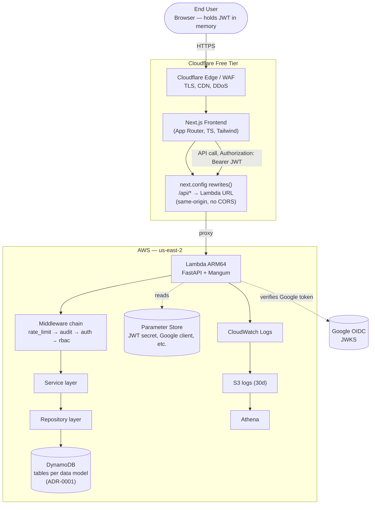
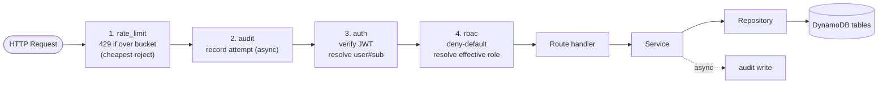

# Carpool Coordinator — System Architecture (Phase 2 Foundation)

> **Status:** Reconciled with the locked decisions in `plans/phase-2-foundation.md` (Progress &
> Decision Log, 2026-06-23) and ADR-0001. Architecture decisions that are hard to reverse require
> an ADR per AGENTS.md §12. This document scopes the **Phase 2 foundation** and notes forward-looking
> hooks for Phases 3–6 without designing them in detail.
>
> **Companion docs:** `docs/functional_requirements_and_architecture.md` (master spec, v2),
> `plans/phase-2-foundation.md` (spec + plan + tasks + decision log), `docs/adr/` (ADRs).
>
> **Prerequisite:** Phase 2 implementation is **gated on Phase 1 Discovery** completing
> `docs/api_contracts.md`, `docs/data_model_erd.md`, and `docs/rbac_matrix.md` (resolved 2026-06-23).

---

## Overview

Carpool Coordinator is a serverless, low-cost, event-driven platform for coordinating carpools
(church gatherings, conferences, volunteering, school trips). Phase 2 builds the **deployable
foundation**: Google OIDC authentication, RBAC authorization, session CRUD, an audit trail, rate
limiting, DynamoDB persistence, CI/CD, and a bootstrapped Next.js frontend.

The system is **single-tenant for MVP** (first user is an internal organization), which justifies
deferring abuse detection/brute-force controls to post-MVP. It is designed for **bursty,
event-based traffic** (registration opens → hundreds of users in minutes) with near-idle steady
state and low cost.

**Functional requirements addressed in Phase 2:** FR-1 (auth + session-code registration entry),
FR-2 (session management), FR-11 (audit logging). FR-3..FR-10 land in Phases 3–5 but their data
shapes are provisioned now.

**Non-functional targets (from spec):**
- API latency **p95 < 800ms** on smoke routes.
- Availability **99.5%**.
- Scalability: idle traffic → burst to **5000 req/min**.
- Security: JWT validation, rate limiting, encrypted storage, no password storage.

---

## Architecture Principles

1. **Serverless-first, cost-driven.** Lambda + DynamoDB on-demand + Cloudflare free tier → $0 idle.
2. **Same-origin by default.** The frontend proxies API calls through Cloudflare Pages `rewrites()`
   so the browser sees one origin — avoids CORS preflight and hides the Lambda URL
   (ADR-004, recommendation).
3. **Deny-default RBAC.** Every protected route explicitly declares required role(s); absence = 403.
4. **Tables named per data model** (LOCKED, ADR-0001). Storage mirrors the Phase 1 ERD; ephemeral
   cache/counter tables use TTL and are isolated from durable application data.
5. **JWT app sessions** (LOCKED). Backend issues a signed JWT after Google OIDC verification;
   frontend stores it **in memory** (not `localStorage`) to resist XSS (ADR-002).
6. **Layered backend.** `api → service → repository`, one-directional dependencies. Controllers know
   nothing about DynamoDB; repositories know nothing about HTTP.
7. **Fail safe, fail cheap.** Cheapest rejection first (rate limit), then expensive verification
   (Google JWKS), then authorization, then business logic.
8. **Observable by construction.** Structured logs + metrics emitted from middleware; audit is
   append-only and non-blocking.

---

## Components

| Component | Responsibility | Phase 2 state |
|-----------|----------------|---------------|
| **Next.js frontend** (Cloudflare Pages) | UI: login, session-code entry, session dashboard, role-aware nav. Static/SSR on Pages edge. | Bootstrap + login + dashboard scaffold |
| **Cloudflare Pages `rewrites()`** | Proxies `/api/*` → Lambda Function URL; same-origin, hides Lambda URL. **Preview-per-branch** deploys. | Configured |
| **Cloudflare Free edge / WAF** | TLS termination, CDN, basic WAF/rate hints, DDoS absorption. | Configured |
| **AWS Lambda (ARM64)** | Runs FastAPI via Mangum. Single function exposed via Function URL. Region: `us-east-2`. | Deployable |
| **FastAPI app** | HTTP layer: routers, Pydantic validation, dependency injection. | Skeleton |
| **Middleware chain** | `rate_limit → audit → auth → rbac` (ordered). | All four |
| **Service layer** | Business logic: session validation, status-transition rules, admin assignment. | Phase 2 subset |
| **Repository layer** | DynamoDB data access; one repo per aggregate. Reads/writes the per-data-model tables from the ERD. | Full |
| **DynamoDB** | Tables named per data model (ADR-0001): app data, session cache, rate-limit cache, brute-force counter (starting set per spec §10; finalized by Phase 1 ERD). | Provisioned via Terraform |
| **Google OIDC** | Identity provider; issues ID tokens the backend verifies against Google JWKS. **Single shared client** for all envs; client ID stored in Parameter Store. | Integrated |
| **AWS Parameter Store** | Secrets/config: Google client ID, JWT signing secret, JWKS URL, OSRM endpoint (Phase 3). Region: `us-east-2`. | Integrated |
| **CloudWatch Logs → S3 → Athena** | Structured app logs; 30-day S3 lifecycle; Athena for incident analysis. | Logs + S3 bucket |
| **Terraform (via GitHub Actions)** | Provisions Lambda, DynamoDB tables, Parameter Store entries, S3, IAM — applied on merge to main. | Pipeline |
| **GitHub Actions** | CI (ruff/mypy/pytest, eslint/tsc/build) + CD (Lambda zip deploy, `wrangler pages deploy`, `terraform apply`). | Both pipelines |

---

## Data Flow

### Request lifecycle (e.g. `POST /sessions`)

```
Browser
  │  (1) call to same-origin /api/sessions via next.config rewrites()
  ▼
Cloudflare Pages edge ──(static/SSR assets cached)──►  Browser
  │  (2) /api/* proxied to Lambda Function URL (Authorization: Bearer <JWT>)
  ▼
AWS Lambda (ARM64, Mangum, us-east-2)
  │  (3) FastAPI middleware/dependency chain:
  │        rate_limit  ──► 429 if bucket exhausted (TTL item in rate-limit table)
  │        audit       ──► record attempt (async, non-blocking)
  │        auth        ──► verify JWT signature/expiry; resolve user sub
  │        rbac        ──► deny-default; resolve global + session role
  ▼
Service layer  ──►  Repository layer  ──►  DynamoDB (per-data-model tables)
                       │
                       └─► Audit write  [async]
  ▼
Response → Cloudflare → Browser (JWT supplied on each call)
```

### Login flow (FR-1, JWT — LOCKED)

```
1. User clicks "Sign in with Google" (GIS button in Next.js)
2. Google issues an ID token (client-side)
3. Browser POSTs token to /api/auth/google (same-origin via rewrites)
4. Backend: fetch+cache Google JWKS → verify signature, audience, expiry
5. Upsert user record in the app-data table (sub, email, name)
6. Issue app session JWT (signed with secret from Parameter Store)
7. Frontend stores JWT in memory (NOT localStorage) + wires Authorization header
8. Subsequent /api/* calls carry the JWT; logout clears it from memory
```

### Session-scoped role resolution (FR-2 + FR-9)

```
For a request to /sessions/{code}/... :
  effective_role = max_by_precedence(
      global_role,            // from user record: Superuser | Manager | (none)
      session_role            // from registration record: Admin | Driver | Passenger
  )
  // Precedence: Superuser > Manager > Admin > Driver > Passenger
```

---

## Technology Stack

| Layer | Choice | Rationale | Tradeoff |
|-------|--------|-----------|----------|
| Compute | AWS Lambda ARM64, 256 MB, 5–10s, **`us-east-2`** (LOCKED) | $0 idle; auto-scales for bursts | Cold start; 15m timeout (matching >300 → async, Phase 4) |
| HTTP framework | FastAPI + Mangum | Async, Pydantic validation, DI for RBAC, Lambda adapter | Minor Mangum overhead |
| Package mgmt | `uv` | Fast, deterministic, lockfile | Newer tooling |
| Lint/types/test | ruff + mypy --strict + pytest | Modern, fast, replaces pylint | Legacy `src/main.py` stays on old toolchain |
| Database | DynamoDB **tables per data model** (LOCKED, ADR-0001), on-demand | $0 idle; single-digit-ms; isolated traffic profiles | No joins; access patterns designed in Phase 1 ERD |
| Identity | Google OIDC | No password storage; trusted issuer | Identity vendor lock-in |
| App session | **JWT** (LOCKED, ADR-002), stored in memory in browser | Stateless; no DB session lookups; XSS-resistant storage | Need refresh strategy; short TTL + careful handling |
| Edge/CDN/WAF | Cloudflare Free | $0; DDoS; TLS; CDN for Pages | Limited WAF rules |
| Frontend | Next.js App Router + TS + Tailwind | SSR + edge; type-safe | Complexity |
| Frontend→Lambda | `@cloudflare/next-on-pages` + Pages `rewrites()` (ADR-004, rec.) | Same-origin; hides Lambda URL; no CORS preflight | Extra hop through CF Workers runtime |
| IaC | **Terraform** (LOCKED) via GitHub Actions, region `us-east-2` | Declarative, mature, broad AWS support | HCL; state backend to manage |
| CI/CD | GitHub Actions | Already used; matrix support | Runner minutes on private repos |
| Observability | CloudWatch Logs → S3(30d) → Athena | Per spec §10; cheap | Athena scan cost on large volumes |

---

## Architecture Diagram

### Component view



### Backend layering & middleware ordering



> **Ordering rationale (ADR-005):** rate-limit first because rejection is O(1) and must protect
> downstream. Auth before RBAC because authorization requires an identity. Audit wraps the chain so
> it captures denials *and* successes with the resolved actor.

---

## Data Model — tables per data model (ADR-0001, LOCKED)

> ADR-0001 rejected single-table consolidation. **Exact table boundaries, names, keys, and GSIs are
> finalized by the Phase 1 ERD (`docs/data_model_erd.md`)** — the architect does not prescribe them
> here. Below is the **logical entity model** (starting from spec §10) plus the access patterns the
> repository layer will need, so Phase 1 can design tables that satisfy them.

### Logical entity groups (likely table boundaries)

| Entity group | Entities | Lifespan | TTL? |
|--------------|----------|----------|------|
| Application data | User, Session, Registration, Match, Audit | Durable | No (PITR on) |
| Session cache | Derived/session-lookup cache | Ephemeral | Yes |
| Rate-limit cache | Per-IP & per-user token buckets | Ephemeral (~120s) | Yes |
| Brute-force counter | Failed-attempt counters (provisioned, deferred) | Ephemeral | Yes |
| Geocode cache | Postal code → coords | Ephemeral (~7d) | Yes (Phase 3) |

### Access patterns the design must satisfy (Phase 2)

- **Get/put user** by `USER#<sub>` (upsert on login).
- **Get/put session** by `SESSION#<code>`.
- **List sessions a user belongs to / admins** → GSI on the app-data table keyed by user → drives
  the dashboard. (Exact GSI name from ERD.)
- **Get/put registration** by `(SESSION#<code>, REG#<sub>)` — powers session-scoped role resolution
  + admin-assignment eligibility check.
- **Append audit** by `AUDIT#<YYYY-MM-DD>` with timestamp+actor SK (spread to avoid hot partition).
- **Rate-limit read/incr** by IP and by user, minute-bucketed, TTL ~120s (2× bucket window).
- **Unique session code** enforce via conditional `PutItem` (SK absence) → 409 on collision.

**Table config (general):** On-demand capacity; PITR enabled on durable tables; TTL attribute
(`expires_at`) on ephemeral tables; encryption at rest (AWS-owned key MVP → KMS CMK in Phase 6).

---

## Decisions (ADRs)

| # | Decision | Status | Rationale | Tradeoff |
|---|----------|--------|-----------|----------|
| ADR-0001 | DynamoDB tables **named per data model** | **LOCKED** (exists) | Storage mirrors ERD; isolated traffic/TTL/capacity | More tables to manage in Terraform |
| ADR-0002 | App session = **JWT** | Accepted | Stateless; no DB lookups | In-memory browser storage; refresh strategy needed |
| ADR-0003 | IaC = **Terraform**; region **`us-east-2`** | Accepted | Mature, broad AWS, declarative | HCL; state backend |
| ADR-004 | Same-origin via CF Pages `rewrites()` | Accepted | Hides Lambda URL; no CORS preflight | Couples frontend deploy to API origin |
| ADR-005 | Middleware order `rate_limit→audit→auth→rbac` | Accepted | Cheapest reject first; captures denials w/ actor | Audit must be non-blocking |
| ADR-006 | Google JWKS cached in Lambda (TTL ~1h) | Accepted | Avoids network call per login → p95 < 800ms | Stale-key window (acceptable) |
| ADR-0007 | DynamoDB on-demand capacity | Accepted | Scales with bursts; $0 idle | Higher cost at sustained high traffic |

> All ADR files written and accepted (2026-06-23): `docs/adr/0001..0007-*.md`.

---

## Failure Modes & Mitigations

| Failure mode | Impact | Mitigation |
|--------------|--------|------------|
| DynamoDB throttling / hot partition | 5xx, dropped writes | On-demand capacity; spread audit SK (timestamp+actor); monitor ThrottledRequests |
| Lambda cold start on first/deploy | p95 spike | Provisioned concurrency deferred to Phase 6; warm `/health`; acceptable for MVP |
| Google JWKS fetch failure | All logins fail (503) | Cache JWKS in Lambda memory (ADR-006); fall back to cached keys; alert on auth-error spike |
| JWT stolen from memory (XSS) | Session hijack | In-memory (not localStorage); short TTL; CSP hardening in Phase 6 |
| CORS / cross-origin issues | API calls blocked | ADR-004 same-origin via rewrites — keeps it single-origin |
| Session code collision | Two sessions, same code | Conditional `PutItem` on SK absence → 409 |
| Audit write slows API | Latency regression | Audit writes async/fire-and-forget; never block response |
| Rate-limit item not expiring | False 429 | TTL ~120s; verify with load test in Phase 6 |
| Cloudflare origin → Lambda latency | p95 breach | Function URL in `us-east-2`; monitor; CF Argo (paid) deferred |
| Secrets leak | Security incident | Parameter Store only; never in repo/env; `.gitignore` enforced |
| Phase 1 ERD reshapes tables after repos built | Rework | Phase 1 is a hard prerequisite (resolved); reconcile repos when ERD lands |

---

## Scalability Path (forward-looking, not Phase 2 work)

- **Burst (registration opens):** Lambda concurrency scales automatically; DynamoDB on-demand
  absorbs. Verify with load test in Phase 6 (target: 5000 req/min).
- **Matching >300 users:** exceeds Lambda timeout → Phase 4 adds SQS/Step Functions/Fargate async
  path (spec §13). Phase 2 leaves `app/services/matching.py` as a stub/placeholder.
- **Multi-region / DR:** out of scope MVP; single-region (`us-east-2`) with PITR is the recovery story.
- **Reserved concurrency:** Phase 6 tuning to control cost under sustained load.

---

## Implementation Guidance (Phase 2)

1. **Phase 1 gate first** — no implementation task starts until `docs/data_model_erd.md`,
   `docs/api_contracts.md`, `docs/rbac_matrix.md` exist (resolved prerequisite).
2. **Order of build** matches plan Tasks 2.1→2.11: scaffold → DynamoDB+repos → auth → RBAC →
   session CRUD → session-code entry → admin assignment → rate limit → audit → CI/CD → frontend.
3. **Derive tables from the ERD** (not this doc) — ADR-0001 makes the ERD the single source of truth
   for table design.
4. **Implement middleware as FastAPI dependencies** (not global middleware) so RBAC is per-route and
   deny-default is enforced by the type system (`Depends(require_role(...))`).
5. **Make audit non-blocking from day one** — `asyncio.create_task` or a background dependency.
6. **Lock the same-origin contract early** (Task 2.11): `next.config.ts` `rewrites()` points
   `/api/*` to the Lambda URL before wiring auth (ADR-004).
7. **Verify NFRs as tasks land**, not at the end: p95 < 800ms and 429 behavior are success criteria —
   add latency assertions to the smoke test in Task 2.10.
8. **Provision infra via Terraform in the same CI** — `terraform apply` on merge to main, after
   tests pass (ADR-003).

---

## Success Criteria (architecture-specific)

- [ ] Component diagram reflects the actual deployed topology (CF Pages + Lambda `us-east-2` + DynamoDB).
- [ ] Every Phase 2 FR (FR-1, FR-2, FR-11) maps to a component + data-flow step.
- [ ] NFRs (p95, availability, 5000/min burst, security) each have an owner component + mitigation.
- [ ] Table design comes from the Phase 1 ERD (ADR-0001) — architecture does not contradict it.
- [ ] Middleware ordering is justified (reject-cheapest-first).
- [ ] JWT session handling is documented (ADR-002) and stored safely (in-memory).
- [ ] All ADRs ≥ 0002 written before the corresponding task starts.
- [ ] Failure modes each have a documented mitigation.

---

## Risks & Open Questions

1. **Phase 1 ERD** is the source of truth for table design — any architect assumptions here are
   superseded when it lands.
2. **JWT refresh strategy** not yet specified — short-lived access token + refresh token, or sliding
   expiry? (Decide during Task 2.3.)
3. ~~Google OAuth client~~ → **Resolved:** single shared client (2026-06-23).
4. ~~Cloudflare Pages~~ → **Resolved:** preview-per-branch (2026-06-23).
5. **Naming settled:** `docs/` is canonical (renamed 2026-06-23).
6. **Reserved concurrency / cold-start budget** deferred — confirm acceptable p95 on first deploy.
7. **Terraform state backend** (S3 + DynamoDB lock) — configure as part of Task 2.10.
