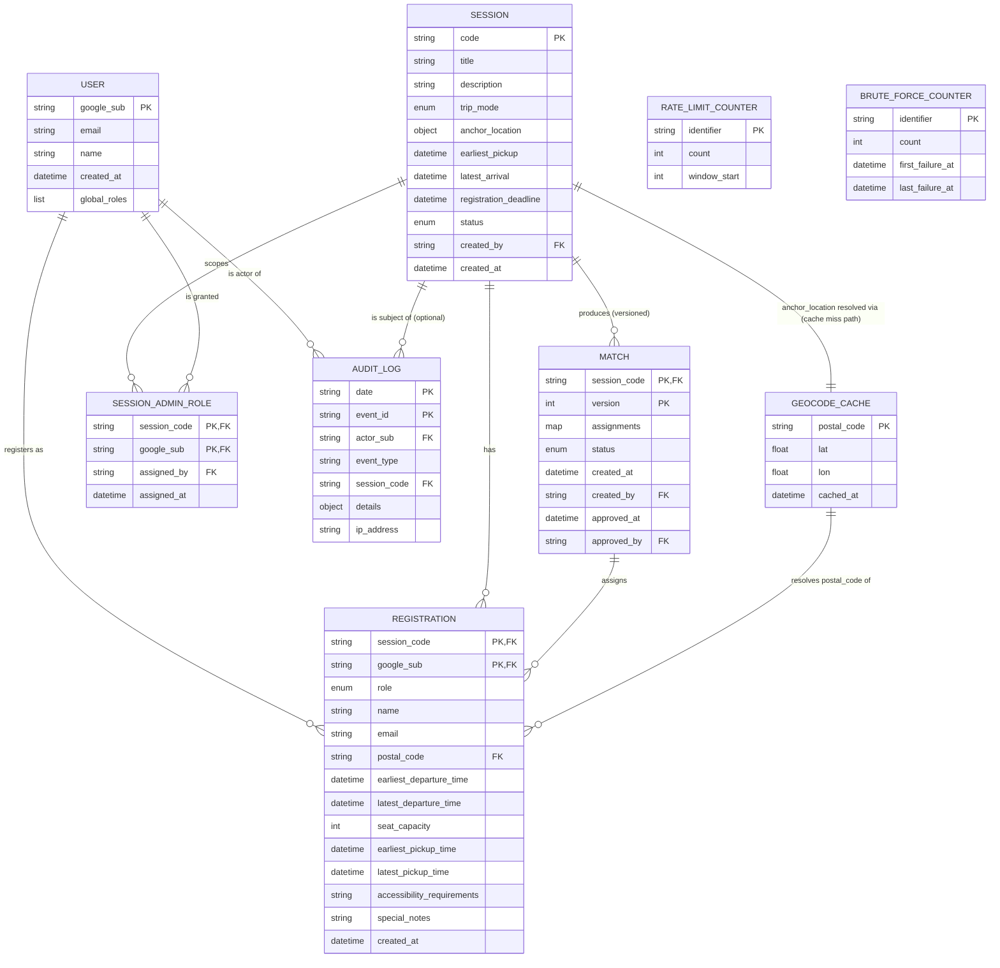

# Data Model & ERD

| Field    | Value                  |
| -------- | ---------------------- |
| Version  | 0.1 (Draft)            |
| Date     | 2026-06-23             |
| Author   | Solution Architect     |
| Status   | Draft — pending review |

> **Implementation note for readers.** The "Single-Table DynamoDB design" called out in
> `docs/functional_requirements_and_architecture.md` §8 is the **single-table pattern inside
> `app_data`** (PK/SK overloading for users, sessions, registrations, matches, etc.). It is
> **not** a statement that *all* data lives in one DynamoDB table. Per
> [ADR-0001](adr/0001-table-naming-by-data-model.md), cache and counter stores are kept in
> **named tables per data model** (see §2 below). If the team decides the cache/counter tables
> should instead be consolidated into `app_data` with TTL, that reversal must be made by
> amending ADR-0001 first; this ERD follows the Accepted ADR.

---

## 1. Single-Table Design Overview (per data model)

The platform uses **five** DynamoDB tables, each named to reflect its data-model concern.
`app_data` itself uses the single-table PK/SK-overloading pattern internally.

| Table                | Purpose                                                                  | Billing      |
| -------------------- | ------------------------------------------------------------------------ | ------------ |
| `app_data`           | All business entities (users, sessions, registrations, matches, admins, audit) | On-demand (ADR-0007) |
| `session_cache`      | Session-scoped ephemeral state cache (TTL)                               | On-demand    |
| `rate_limit_cache`   | Per-IP / per-user request counters (TTL, short window)                   | On-demand    |
| `brute_force_counter`| Failed-auth counter for lockout / exponential backoff (TTL)              | On-demand    |
| `geocode_cache`      | Postal-code → (lat, lon) cache (TTL, 30 days)                            | On-demand    |

**On-demand capacity** for all tables per [ADR-0007](adr/0007-dynamodb-on-demand.md) (zero
idle cost, instant scaling, no per-table capacity tuning needed for multi-table design).

**Why tables are split (not consolidated):** see [ADR-0001](adr/0001-table-naming-by-data-model.md).
In short — heterogeneous access profiles (hot rate-limit writes vs. cold audit writes),
independent TTL/backup/capacity tuning, and the storage layer mirrors the data model.

**Why `app_data` is a single-table design internally:** the FR-defined access patterns
("list registrations for session", "find approved match for session", "list sessions for
user") require co-locating entities that share `SESSION#<code>` or `USER#<google_sub>`
partition keys. Splitting `app_data` into one-table-per-entity would force cross-table
joins or duplicated PK prefixes across tables. The single-table pattern *within* a named
table is a different (and complementary) concern from ADR-0001's multi-table decision.

---

## 2. Entity Catalog

> **Notation.**
> - `PK` = partition key, `SK` = sort key. Compound in the form `KEY#<value>` is a
>   conventional separator; values must not contain `#`.
> - Items with `TTL` use a top-level `ttl` attribute (DynamoDB epoch-seconds) so DynamoDB
>   auto-expires them. The attribute name is reserved.
> - Logical entity types are the units of the ER diagram (§7). PK/SK patterns below are
>   the physical implementation in `app_data` (or in the dedicated cache/counter table).

### 2.1 User
- **Table:** `app_data`
- **PK:** `USER#<google_sub>`
- **SK:** `METADATA`
- **Attributes:**
  - `email` (string, Google-verified)
  - `name` (string)
  - `created_at` (ISO-8601 timestamp)
  - `global_roles` (list of string, e.g. `["manager"]`; `["superuser"]`; default `[]`)
    **Note:** DynamoDB stores a list; the app session JWT (ADR-0002) encodes only the
    highest-precedence role as a singular `global_role` claim. A user holds exactly one
    global role in MVP scope — the list type is forward-compatible with multi-role users
    post-MVP.
- **Purpose:** Identity record for every Google-authenticated principal. Holds *global*
  roles only; session-scoped roles (Driver / Passenger / Session Admin) are on
  Registration / Session-Admin-Role items, never on the User.

### 2.2 Session
- **Table:** `app_data`
- **PK:** `SESSION#<code>` where `<code>` is the short invite code
- **SK:** `METADATA`
- **Attributes:**
  - `code` (string — **6‑char uppercase alphanumeric, server‑generated**, collision‑retry on insert)
  - `title` (string)
  - `description` (string)
  - `trip_mode` (enum: `TO_DESTINATION` | `FROM_ORIGIN`; `FROM_ORIGIN` accepted but deferred post‑MVP — see OQ‑7)
  - `anchor_location` (map: `{ lat: number, lon: number }`) — destination or origin per trip_mode
  - `capacity_hint` (integer, optional — suggested seat count for UI defaults; not enforced, Phase 2)
  - `earliest_pickup` (ISO-8601 timestamp)
  - `latest_arrival` (ISO-8601 timestamp)
  - `registration_deadline` (ISO-8601 timestamp)
  - `status` (enum: `draft` | `registration_open` | `matching_pending` | `matching_proposed` | `approved` | `closed`)
  - `created_by` (string — Google `sub` of creator)
  - `created_at` (ISO-8601 timestamp)
  - `capacity_hint` (integer, optional — suggested default seat count for UI hints; no enforcement)
- **Purpose:** Root of a carpool event. All session-scoped data (registrations, matches,
  admin roles) shares this PK.

### 2.3 Registration
- **Table:** `app_data`
- **PK:** `SESSION#<code>`
- **SK:** `REG#<google_sub>`
- **Attributes (common):**
  - `role` (enum: `driver` | `passenger`)
  - `name` (string)
  - `email` (string)
  - `postal_code` (string)
  - `earliest_departure_time` (ISO-8601)
  - `latest_departure_time` (ISO-8601)
  - `created_at` (ISO-8601)
- **Attributes (driver-only):**
  - `seat_capacity` (integer)
  - `earliest_pickup_time` (ISO-8601)
  - `latest_pickup_time` (ISO-8601)
- **Attributes (passenger-only):**
  - `accessibility_requirements` (string, free text)
  - `special_notes` (string, free text)
- **Purpose:** One row per (session, user). Created by `POST /sessions/{code}/register`
  (FR-3 / FR-4). No TTL — durable business data.
- **GSI projection note:** Registration items also project a copy of `google_sub` as
  `user_sub` so the `sessions-by-user` GSI can be populated (see §3.2).

### 2.4 Match (versioned)
- **Table:** `app_data`
- **PK:** `SESSION#<code>`
- **SK:** `MATCH#V<n>` where `<n>` is a monotonically increasing zero-padded integer
  (`V1`, `V2`, …, `V10`, `V100`). Zero-padding ensures lexicographic sort order matches
  numeric order.
- **Attributes:**
  - `version` (integer — the numeric `n`)
  - `assignments` (list of objects: `[ { driver_sub, passenger_subs, pickup_order, locked }, … ]`)
    — ordered by pickup sequence; `pickup_order` is 1-indexed; `locked` = true means the
    driver's route is protected from auto re-match overwrite (FR-8)
  - `unassigned` (list of strings — passenger subs not assigned to any driver)
  - `status` (enum: `proposed` | `approved`)
  - `created_at` (ISO-8601)
  - `created_by` (string — Google `sub` of admin who ran the algorithm or override)
  - `approved_at` (ISO-8601, present iff `status == "approved"`)
  - `approved_by` (string — Google `sub` of approving admin, present iff approved)
  - `match_score` (map: optional per-driver debug scores; admin-only)
- **Purpose:** A single proposed or approved assignment snapshot. Versioning is the
  source of truth for "what is currently active" (see §4) and the historical record of
  every proposed/approved iteration.
- **No TTL** — durable business data; old versions are retained for audit.

**Per-driver denormalization decision (OPTIONAL items).** A `MatchAssignment` could be
emitted as a separate item (`PK = SESSION#<code>`, `SK = ASSIGN#MATCH#V<n>#DRIVER#`)
to make per-driver "who do I pick up" queries a single `GetItem` instead of a `Get` on
the parent `MATCH#V<n>` plus list scan. We **do not** denormalize at this stage.
Rationale:

- The match payload is small (≤500 participants → a single item well under DynamoDB's
  400 KB limit).
- A denormalized assignment item would need to be kept in sync with the parent match
  (transactional write on every manual override — FR-8) — extra cost and complexity
  for negligible read benefit.
- The hot path for "my assignment" is keyed by `(google_sub, session_code)`, which is
  already served by the `sessions-by-user` GSI → `GetItem` on `REG#` to learn the
  user is registered, then `GetItem` on `MATCH#V<latest_approved>` and an in-memory
  filter to find the driver's assignment object from the `assignments` list.
- A single-item model keeps the matching approval transaction to one item (`UpdateItem`
  on the `MATCH#V<n>` to flip `proposed` → `approved`), avoiding cross-item conditional
  writes.

This can be revisited in Phase 6 hardening if production read patterns show the in-memory
filter is hot.

### 2.5 Session Admin Role
- **Table:** `app_data`
- **PK:** `SESSION#<code>`
- **SK:** `ADMIN#<google_sub>`
- **Attributes:**
  - `assigned_by` (string — Google `sub` of assigner)
  - `assigned_at` (ISO-8601)
- **Purpose:** Per-session admin grant (FR §4.2.2). Existence of this item grants
  Session Admin on `<code>`; absence (combined with no global role) denies it. RBAC
  resolution walks `global_roles` on the User first, then Session Admin items for the
  active session.

### 2.6 Audit Log
- **Table:** `app_data`
- **PK:** `AUDIT#<YYYY-MM-DD>` (date in UTC) — partitions by day for bounded partition
  size and easy time-range queries via `BETWEEN`.
- **SK:** `<ISO-timestamp>#<event_id>` where `<event_id>` is a UUIDv4 suffix to keep SKs
  unique even at sub-millisecond resolution. Format example:
  `2026-06-23T17:09:00.123Z#5b2c…`. Sorted lexicographically = chronologically.
- **Attributes:**
  - `actor_sub` (string — Google `sub` of the principal; `anonymous` for unauthenticated events)
  - `event_type` (string, e.g. `login_success`, `match_approved`, `admin_override`)
  - `session_code` (string, optional — only when event is session-scoped)
  - `details` (map — event-specific structured payload; free-form)
  - `ip_address` (string — client IP, captured at edge)
- **Purpose:** Immutable audit trail (FR-11). No TTL — retained per the S3 lifecycle
  policy in the architecture doc (30-day archive to S3, then long-term retention rule
  TBD). For active-window queries the `PK` partition + `SK` `BETWEEN` scan is efficient
  because each day is its own partition.

### 2.7 Geocode Cache
- **Table:** `geocode_cache` (per ADR-0001 — separate from `app_data`)
- **PK:** `GEOCACHE#<postal_code>` (uppercased, whitespace-stripped)
- **SK:** `METADATA`
- **Attributes:**
  - `lat` (number)
  - `lon` (number)
  - `cached_at` (ISO-8601)
  - `ttl` (epoch-seconds — DynamoDB TTL attribute; ~30 days)
- **Purpose:** Cache postal-code → (lat, lon) lookups (FR-5) so we don't hit Nominatim
  on every registration. TTL = 30 days (configurable per region / upstream change cadence).

### 2.8 Rate-Limit Counter
- **Table:** `rate_limit_cache` (per ADR-0001)
- **PK:** `RATELIMIT#<identifier>` where `<identifier>` is `ip:<ip>` or `user:<google_sub>`
- **SK:** `METADATA`
- **Attributes:**
  - `count` (integer — requests in current window)
  - `window_start` (epoch-seconds — start of the current rate-limit window)
  - `ttl` (epoch-seconds — DynamoDB TTL; matches the window length: 60s for IP,
    120s for user)
- **Purpose:** Sliding-window request counters (FR §14: 60 req/min per IP, 120 req/min
  per user). TTL ensures the counter expires when the window ends.

### 2.9 Brute-Force Counter
- **Table:** `brute_force_counter` (per ADR-0001)
- **PK:** `BF#<identifier>` (e.g. `BF#ip:<ip>`, `BF#email:<email>`, `BF#user:`)
- **SK:** `METADATA`
- **Attributes:**
  - `count` (integer — consecutive failures)
  - `first_failure_at` (ISO-8601)
  - `last_failure_at` (ISO-8601)
  - `ttl` (epoch-seconds — DynamoDB TTL; configurable: 15 min short-window, up to 24h
    for sustained ban)
- **Purpose:** Failed-auth tracking for lockout / exponential backoff (architecture
  §14 Abuse Detection).

---

## 3. Access Patterns → GSI Design

GSIs are defined on `app_data` only. Cache and counter tables are not queried via
cross-cutting indexes; they are direct-keyed.

### 3.1 Main-table access patterns (no GSI required)

| Access pattern                                    | Table op                              | PK / SK                                    |
| ------------------------------------------------- | ------------------------------------- | ------------------------------------------ |
| Get user profile                                  | `GetItem`                             | `USER#` / `METADATA`                  |
| Get session by code                               | `GetItem`                             | `SESSION#<code>` / `METADATA`              |
| List registrations for a session                  | `Query` `SK begins_with REG#`         | `SESSION#<code>` / `REG#…`                 |
| Get a user's registration for a session           | `GetItem`                             | `SESSION#<code>` / `REG#`             |
| List all Session Admins for a session             | `Query` `SK begins_with ADMIN#`       | `SESSION#<code>` / `ADMIN#…`               |
| List all match versions for a session             | `Query` `SK begins_with MATCH#`       | `SESSION#<code>` / `MATCH#V…`              |
| List audit events for a day                       | `Query` `SK BETWEEN …`                | `AUDIT#<date>` / `<ts>#<id>`               |
| List audit events for a session on a day          | `Query` + `FilterExpression session_code = :s` | `AUDIT#<date>` / `<ts>#<id>`     |

### 3.2 GSI1 — `sessions-by-user`

Purpose: a user (or superuser, on behalf of any user) needs to list all sessions a
user is registered in ("my sessions"). The main table's PK is session-scoped, so this
requires an inverted index driven from the Registration items.

- **GSI name:** `gsi_sessions_by_user`
- **Index PK:** `USER#<google_sub>` (sourced from Registration `google_sub`)
- **Index SK:** `SESSION#<code>`
- **Source:** Registration items (§2.3) project these two attributes into the GSI.
  Implementation: when writing a Registration, also write the GSI keys (either via
  GSI projection if `app_data` GSI key schema matches, or via a denormalized attribute
  set on the Registration item).
- **Projected attributes:** `ALL` (admin UI needs full registration; participant view
  needs the registration row to render "my assignment"). A `KEYS_ONLY` projection is
  sufficient if the access pattern is just "list my session codes" — but
  `GET /sessions/{code}/me` is a hot path, so we keep `ALL` to avoid a follow-up
  `BatchGetItem`.
- **Serves access pattern:** "List all sessions a given user is registered in."

### 3.3 GSI2 — `latest-match-by-session`

Purpose: admin and participant flows need the *currently approved* match for a
session without scanning every `MATCH#V<n>` item. The phase-1 plan calls this out as
the "latest-match-by-session" index.

- **GSI name:** `gsi_latest_match_by_session`
- **Index PK:** `SESSION#<code>`
- **Index SK:** `MATCH#V<n>` (zero-padded, see §2.4)
- **Source:** Match items (§2.4).
- **Projected attributes:** `ALL` (the approved version's assignments are read on every
  participant "my assignment" view).
- **Query semantics:**
  1. `Query` `PK = SESSION#<code>`, `ScanIndexForward = false`, `Limit = 1` — returns
     the **highest version** (latest proposal, regardless of status). Useful for
     "what is the most recent proposed version".
  2. To retrieve the **currently approved** version, the same `Query` is used with a
     `FilterExpression status = "approved"`. Because approved versions are sparse
     (one per session at a time), the filter cost is bounded. The repository layer
     materializes a cache key (e.g. via `session_cache`) for the most recent approved
     `MATCH#V<n>` so the hot path avoids the filter.
  3. Pagination: a session with many historical versions paginates with
     `ExclusiveStartKey`; admin "history" view walks all versions.

### 3.4 GSI3 — `admins-by-user`

Purpose: a Session Admin who is not registered as a Driver or Passenger needs to list sessions they administer ("my admin sessions"). The dashboard wireframe's "Administer" tab requires this.

- **GSI name:** `gsi_admins_by_user`
- **Index PK:** `USER#<google_sub>` (sourced from Session Admin Role `google_sub`)
- **Index SK:** `SESSION#<code>`
- **Source:** Session Admin Role items (§2.5)
- **Projected attributes:** `ALL` (admin dashboard needs the session code + assignment metadata)

### 3.5 GSI summary

| GSI                          | Index PK        | Index SK         | Projection | Source entity       |
| ---------------------------- | --------------- | ---------------- | ---------- | ------------------- |
| `gsi_sessions_by_user`       | `USER#`    | `SESSION#<code>` | `ALL`      | Registration        |
| `gsi_latest_match_by_session`| `SESSION#<code>`| `MATCH#V<n>`     | `ALL`      | Match               |
| `gsi_admins_by_user`         | `USER#`    | `SESSION#<code>` | `ALL`      | Session Admin Role  |

No other GSIs are required by FR-1..FR-11. Adding GSIs in Phase 2+ requires an ADR per
AGENTS.md §12.

---

## 4. Match Versioning Rule

Per `plans/phase-1-discovery.md` Task 4. Authoritative — referenced by Phase 4 and
Phase 5 implementations.

1. **Every `POST /sessions/{code}/match/run` writes a NEW item** with
   `SK = MATCH#V{n+1}` where `n` is the current highest version for that session
   (read with `Query` `SK begins_with MATCH#`, `ScanIndexForward = false`, `Limit = 1`).
   - The new item is created with `status = "proposed"`.
   - The algorithm result is written to `assignments` (§2.4).
   - The write is conditional: the GSI key does not exist (a re-run after a previous
     run is intentionally allowed and produces a new version).
2. **Admin approval is a single-item state transition.** `POST /sessions/{code}/match/approve`
   targets the highest-version `MATCH#V<n>` (the latest proposal) and flips
   `status` from `proposed` to `approved`, stamping `approved_at` and `approved_by`.
   - Exactly one match version is `approved` per session at any time. All other
     versions remain `proposed` (historical record) — they are never deleted.
3. **Visibility rule (FR-7).** Participants can read only the `MATCH#V<n>` whose
   `status == "approved"`. Proposed versions are admin-only. This is enforced at the
   repository layer: the participant-facing read path uses the "latest approved" query
   (§3.3 option 2) and never returns a `proposed` item.
4. **Admin override after approval (FR-8).** Triggering a manual override after a
   match is already approved creates a NEW version `MATCH#V{n+1}` with
   `status = "proposed"` (the override is the new proposal). The admin then approves
   the new version, which atomically transitions it to `approved`. The previous
   approved version remains in the table as `proposed` history (its `status` is
   left as-is — it was `approved` at the time, and remains the historical snapshot
   for that point in time; only the *current* approved version is what participants
   see, determined by the version number on the new approved item).
5. **Re-running the algorithm after approval.** Per FR-7 / FR-8, re-running creates a
   new `MATCH#V{n+1}` with `status = "proposed"`; the previously approved version
   stays `approved` until the new version is itself approved (at which point the
   new version becomes the active one — the old version's `approved_at` /
   `approved_by` remain unchanged for historical accuracy).

---

## 5. TTL Strategy

| Item type               | Table               | TTL attribute | Default window  | Configurable? |
| ----------------------- | ------------------- | ------------- | --------------- | ------------- |
| Geocode cache           | `geocode_cache`     | `ttl`         | 30 days         | Yes (env / SSM) |
| Rate-limit counter (IP) | `rate_limit_cache`  | `ttl`         | 60 seconds      | Yes           |
| Rate-limit counter (user) | `rate_limit_cache`| `ttl`         | 120 seconds     | Yes           |
| Brute-force counter     | `brute_force_counter`| `ttl`        | 15 min (short) to 24h (ban) | Yes |
| Session cache (transient view state) | `session_cache` | `ttl` | TBD by Phase 2 | Yes |

**No TTL on entity data** in `app_data` — users, sessions, registrations, matches,
session-admin roles, and audit logs are durable. Audit retention is governed by the
S3 archive lifecycle (architecture §10, 30-day default) and any future long-term
retention policy.

DynamoDB TTL deletion is **eventual** (typically within 48 hours of expiry). Cache and
counter code paths must not assume a TTL-expired item is immediately absent — the
read path is idempotent (re-derive / re-increment on miss).

---

## 6. Cross-References

- [ADR-0001](adr/0001-table-naming-by-data-model.md) — Tables named per data model (this
  ERD's table split is derived from this ADR).
- [ADR-0007](adr/0007-dynamodb-on-demand.md) — On-demand billing for all tables.
- Spec §8 — Data Model (PK/SK primitives; this ERD refines the spec into implementable
  patterns).
- Spec §7 — Session Geometry Model (`anchor_location` attribute on Session).
- `plans/phase-1-discovery.md` Task 4 — source for the GSI list and the match-versioning
  rule.
- FR-1 — Authentication (User entity; `google_sub` is the durable subject identifier).
- FR-2 — Session attributes (Session entity).
- FR-3 / FR-4 — Registration fields (Registration entity; driver/passenger split is
  encoded in optional attributes, not in separate item types).
- FR-5 — Geolocation (Geocode Cache table).
- FR-6 — Matching engine output (Match entity, `assignments` map).
- FR-7 — Approval workflow (Match versioning rule §4).
- FR-8 — Manual override (creates new match version per §4.4).
- FR-11 — Audit logging (Audit Log entity).

---

## 7. ER Diagram (Logical)

The physical storage is multi-table (per ADR-0001) with `app_data` using the
single-table PK/SK pattern internally. The diagram below shows the **logical** entity
relationships — the conceptual model, not the physical table layout.

---

## 8. Open Questions / Follow-ups (Resolved 2026-06-24)

| Question | Resolution | Phase |
| --- | --- | --- |
| **Session cache contents** — what specifically goes in `session_cache`? Candidates: hot "current approved match per session" pointer, or short-lived registration-in-progress state. | **Deferred to Phase 3.** Not needed by any Phase 2 code path. Added to Phase 3 task list. | Phase 3 |
| **Geocode cache key normalization** — Phase 3 must lock the normalization (uppercase, strip whitespace, handle Canadian postal codes `A1A 1A1`, US ZIP+4). | Carried forward to Phase 3. Already called out in `plans/phase-3-registration.md`. | Phase 3 |
| **Audit-log retention** — spec implies 30-day S3 archive, but no clear policy on active-DynamoDB retention. Original proposal was 90 days; revised per human decision. | **30 days hot in DynamoDB** (matches S3 lifecycle + idle cost constraint ≤ $1/month). After 30 days, data is in S3 only (queryable via Athena per NFR-OPS-3). Requires human approval for DB schema changes per AGENTS.md §12. | Phase 6 |
| **GSI write cost** — `gsi_sessions_by_user` projects every Registration write. Acceptable at MVP scale; revisit if write volume grows. | Carried forward to Phase 6 hardening. | Phase 6 |
| **`session_cache` table definition** — not enumerated in this ERD because Phase 2 has not finalized the contents. | **Deferred to Phase 3.** Table is provisioned in Phase 2 (Task 2.2, Terraform); schema definition added in Phase 3 when contents are finalized. | Phase 3 |
| **`idempotency` table** — referenced in `docs/api_contracts.md` §1.6 for `POST /match/run` idempotency but not enumerated in ERD §1. | **Deferred to Phase 4.** Table definition (PK=`IDEMPOTENCY##<session>#<key>`, SK=`METADATA`, TTL=24h) added in Phase 4 when the matching engine endpoint is implemented. Not provisioned in Phase 2. | Phase 4 |
